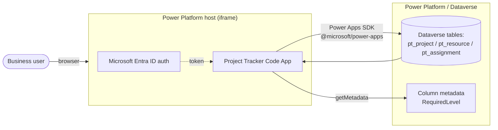
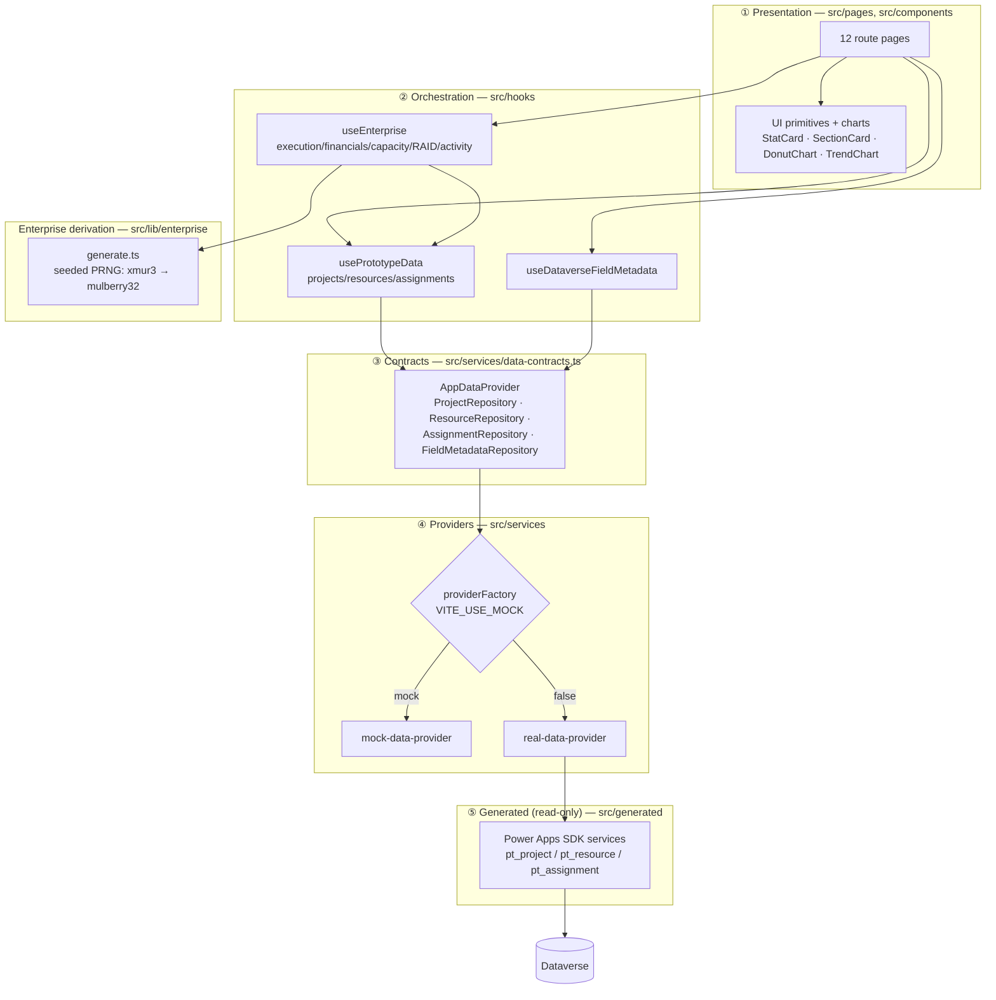
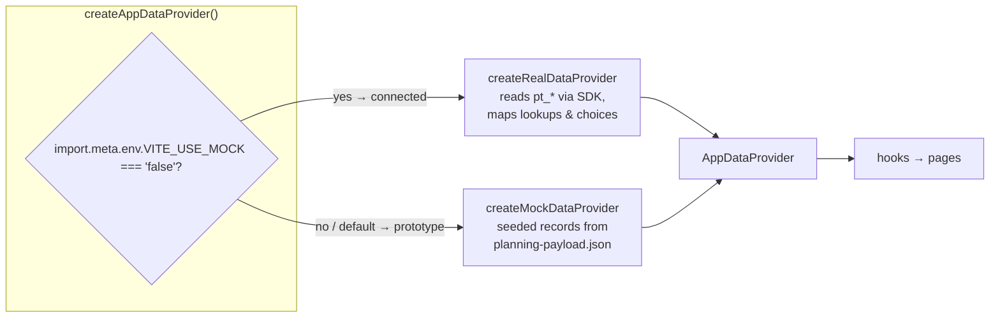
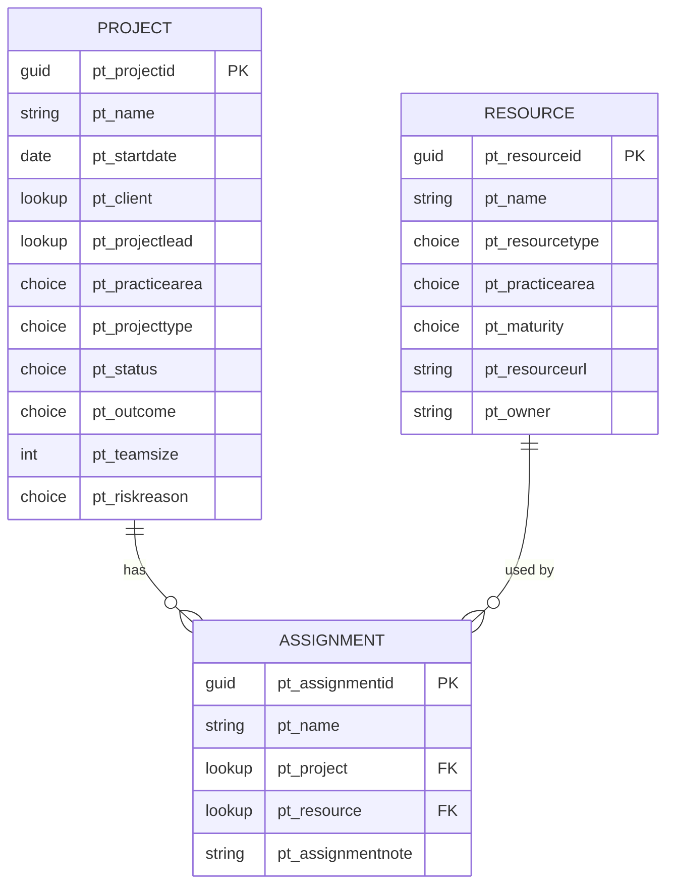
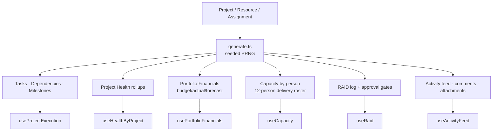
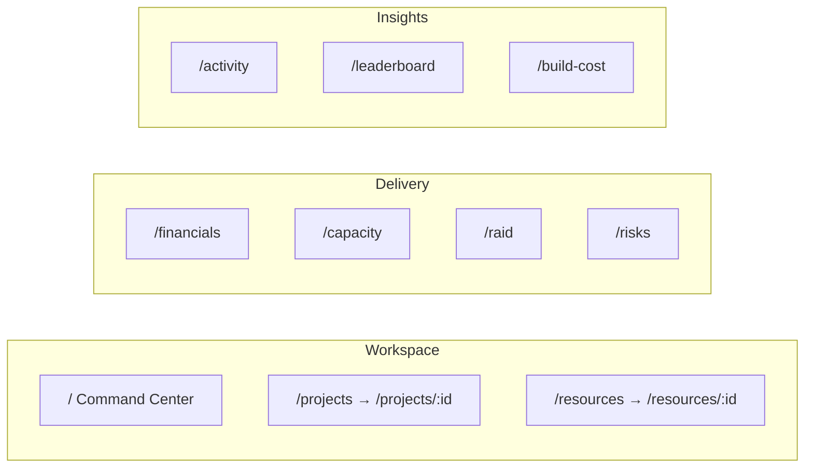
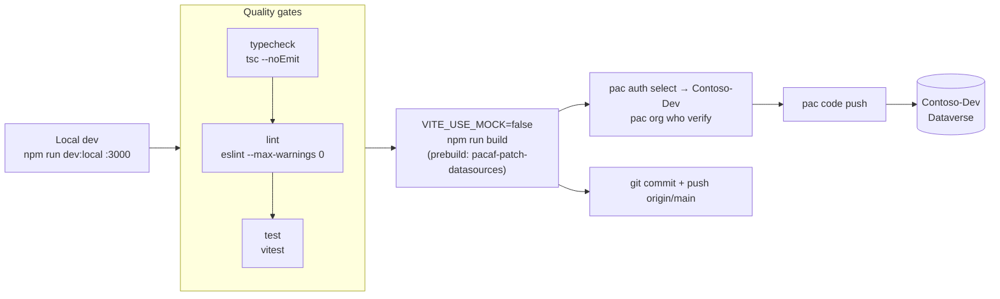

# Project Tracker — Architecture

A **Power Apps Code App** for portfolio and delivery intelligence: Vite + React 18 +
TypeScript + Fluent UI v9, deployed to Dataverse via `pac code push` and authenticated
by Microsoft Entra ID through the Power Platform host.

The defining architectural idea is a **provider-swappable data layer**. Every screen
renders identically whether it is reading seeded mock data (prototype) or live Dataverse
records (connected), selected at runtime by a single environment variable
(`VITE_USE_MOCK`). On top of the three persisted Dataverse tables, an **enterprise
capability layer** derives execution, financial, capacity, RAID, and collaboration data
**deterministically** from the base records — so the richer surfaces work in both modes
with zero extra provisioning.

---

## 1. System context

- **Host-owned auth.** The Power Platform host injects the Entra token; the app never
  calls MSAL or any auth library directly.
- **Host-owned URL path.** The iframe only reliably owns the fragment, so the app uses
  **`HashRouter`** (never `BrowserRouter`). See `src/main.tsx`.
- **Data access via the SDK only.** The generated `@microsoft/power-apps` services are the
  sole channel to Dataverse; no direct DB clients or REST calls bypass them.

---

## 2. Layered architecture

The app follows the template's three-layer contract: **components render, hooks
orchestrate, providers expose contracts, generated services stay behind adapters.**

**Rules enforced by this shape**

- `src/generated/**` is **read-only** (produced by `pac code add-data-source`); it is
  wrapped by `real-data-provider.ts`, never called from components.
- Components depend on the **`AppDataProvider` interface**, not on any concrete provider —
  which is exactly what makes mock ↔ live swappable.
- The enterprise layer never touches Dataverse directly; it derives from the base domain
  objects returned by the providers.

---

## 3. The provider swap (mock ↔ live)

| Mode | Selected by | Data source | Footer badge |
|---|---|---|---|
| **Prototype** (default) | `VITE_USE_MOCK` unset / `true` | `mock-data-provider` (seeded) | `Prototype · mock data` |
| **Connected** | `VITE_USE_MOCK=false` (set at build) | `real-data-provider` → Dataverse | `Live · Dataverse` |

`dev:local` and tests run in prototype mode; the deploy build sets `VITE_USE_MOCK=false`
before `vite build` so the pushed bundle talks to Dataverse.

> **Known limitation:** `real-data-provider` reads the `projectLead` / `client` lookups but
> stubs their *writes* (`@odata.bind` omitted in `mapProjectToConnector`), and the seeded
> lookups are sparse. This is why the enterprise capacity model deliberately **does not**
> group by `projectLead` (see §5).

---

## 4. Persisted data model (Dataverse)

Three tables in a user-owned ⇄ org-owned pattern joined by a junction, publisher prefix
`pt_`. Source of truth: `dataverse/planning-payload.json`; app-side mirror:
`src/types/domain-models.ts` + `src/lib/optionSets.ts`.

Choice values follow the publisher choice-value convention (`100000000+`). Global choice
sets (Practice Area, Status, Outcome, Resource Type, etc.) are mirrored in `optionSets.ts`
for prototype rendering and come from option-set metadata in connected mode.

---

## 5. Enterprise capability layer (derived, deterministic)

The Financials, Capacity, RAID, Activity, and Project-Detail surfaces are **not** backed by
new tables. `src/lib/enterprise/generate.ts` derives them from the base records using a
seeded PRNG (`xmur3` → `mulberry32`), keyed off each `project.id`. Because the seed is the
project id (mock string *or* live GUID), output is **stable per render and identical across
mock and live** — no provisioning, no drift.

**Capacity model (realistic team).** Rather than group by the sparse `projectLead` lookup,
each project is assigned a lead deterministically from a fixed **12-person delivery roster**
(`pickFromSeed('lead:'+id, roster)`; first 6 match `mockTeamMembers`). Weekly utilization
against a 40h baseline scales with team size for **active** projects only; completed work
doesn't consume current load. Rows carry `available | balanced | over` status. This yields a
full, well-distributed team in both modes.

Types for the whole layer live in `src/lib/enterprise/model.ts` (`Task`, `Milestone`,
`ProjectHealth`, `ProjectFinancials`, `RaidItem`, `ApprovalGate`, `ActivityEvent`,
`PersonCapacity`, …) with shared presentation helpers (`healthColor`, `severityColor`,
`capacityColor`).

---

## 6. Navigation & routes

`HashRouter` → `AppShell` (three-group sidebar) → `Routes` in `src/App.tsx`.

| Group | Routes | Purpose |
|---|---|---|
| **Workspace** | Command Center, Projects (+ detail), Resource Library (+ detail) | Core CRUD & portfolio home |
| **Delivery** | Financials, Capacity, RAID & Governance, At-Risk Projects | Execution & governance surfaces |
| **Insights** | Activity, Leaderboard, **AI Build Cost** | Analytics + AIC telemetry dashboard |

Unknown paths redirect to `/`.

---

## 7. Cross-cutting concerns

- **State/data fetching:** `@tanstack/react-query` (`QueryClientProvider` in `main.tsx`,
  5-minute `staleTime`); hooks wrap the provider repositories.
- **Theming/UI:** Fluent UI v9 (`FluentProvider` + `webLightTheme`) exclusively; charts are
  hand-built SVG primitives under `src/components/charts`.
- **Form-field metadata pattern:** editable Dataverse-bound fields use a
  `DataverseFieldLabel` primitive backed by live column metadata
  (`useDataverseFieldMetadata` → `FieldMetadataRepository`) so required-level indicators and
  client-side guards track each column's `RequiredLevel` without hardcoding.
- **AI Build Cost page:** `src/data/aicUsage.ts` is committed build telemetry (from the
  `aic-tracker` skill) plus a manual-build baseline, surfaced read-only in `/build-cost`.

---

## 8. Build, quality gates & deployment

- **Port 3000** is required for local dev (Power Apps SDK contract).
- `vite.config.ts` sets `base: './'` for production so assets resolve inside the iframe.
- The `prebuild` hook (`pacaf-patch-datasources`) fails the build if `BrowserRouter` sneaks
  back in.
- **Deploy discipline:** PAC defaults to the wrong profile — always
  `pac auth select` the Contoso-Dev profile and verify with `pac org who` before
  `pac code push`.

---

## 9. Key directories

| Path | Responsibility |
|---|---|
| `src/main.tsx` | Providers wiring (Query, Fluent, **HashRouter**) |
| `src/App.tsx` | Route table |
| `src/components/shell/AppShell.tsx` | Sidebar nav + live/prototype badge |
| `src/pages/**` | 12 route pages |
| `src/components/{ui,charts}/**` | Fluent primitives + SVG charts |
| `src/hooks/**` | Orchestration hooks over providers + enterprise layer |
| `src/services/data-contracts.ts` | `AppDataProvider` interface (the swap seam) |
| `src/services/{mock,real}-data-provider.ts` | Concrete providers |
| `src/services/providerFactory.ts` | `VITE_USE_MOCK` selection |
| `src/generated/**` | **Read-only** Power Apps SDK services |
| `src/lib/enterprise/{model,generate}.ts` | Derived enterprise data + types |
| `src/lib/optionSets.ts` | Choice-set mirror |
| `src/types/domain-models.ts` | Base domain types |
| `src/data/aicUsage.ts` | AI Build Cost telemetry |
| `dataverse/**` | Planning payload + provisioning/registration plans |

---

## 10. Architectural invariants (do not violate)

1. Deliverable is a **Code App** — no alt hosts, frameworks, or CSS libraries.
2. **Solution-first**, publisher prefix `pt_`.
3. `src/generated/**` is **read-only**.
4. **Three layers:** components → hooks → provider contracts → generated adapters.
5. **Port 3000** for dev; **`base: './'`** for production builds.
6. **`HashRouter`**, never `BrowserRouter`.
7. No secrets in source; auth is host-provided.
8. Enterprise surfaces stay **derived + deterministic** (seeded by project id) so mock and
   live agree.
